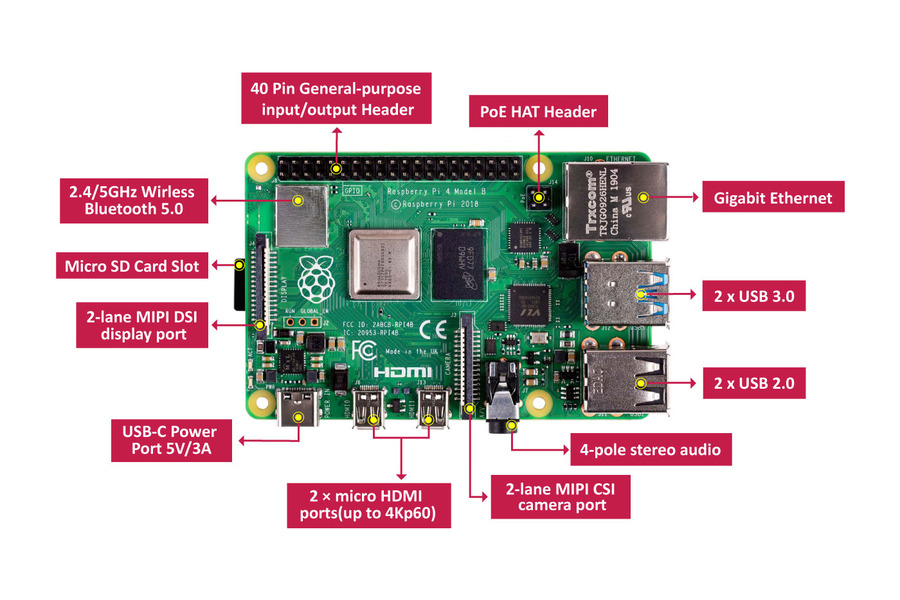
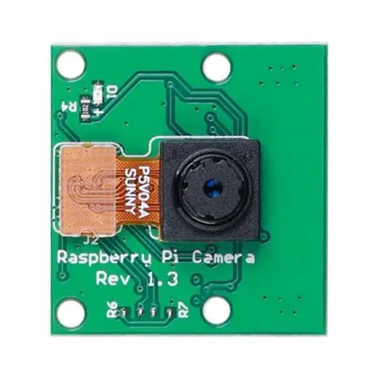
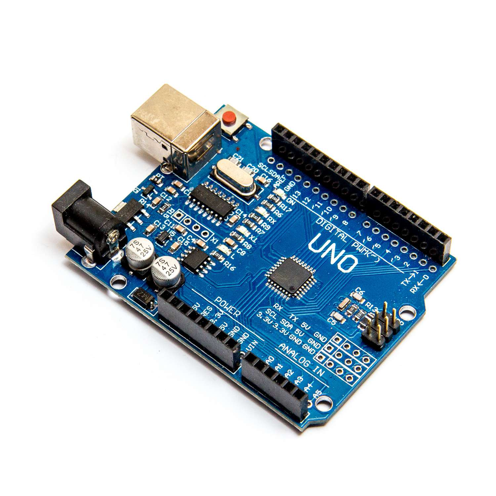
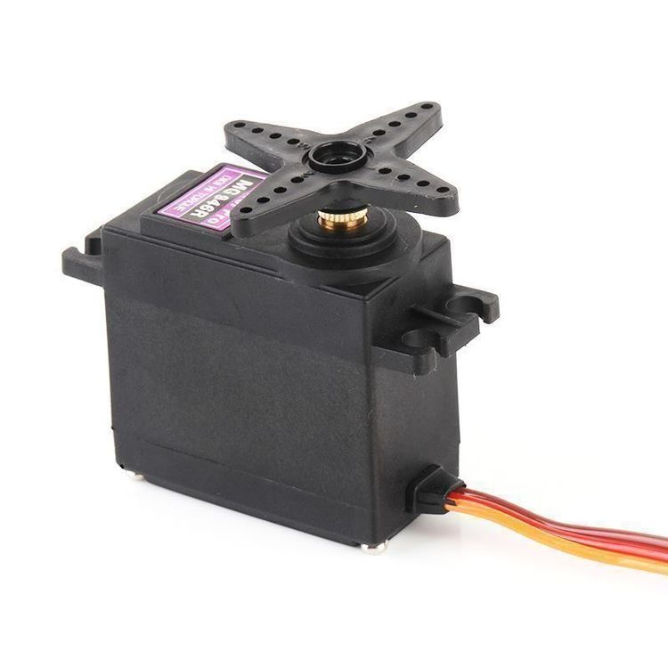
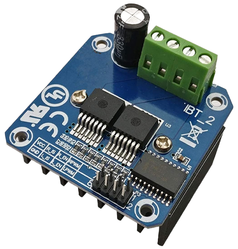
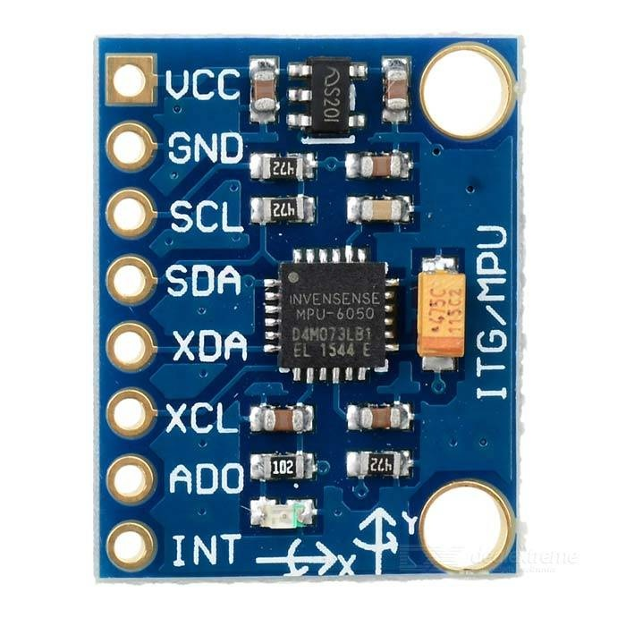
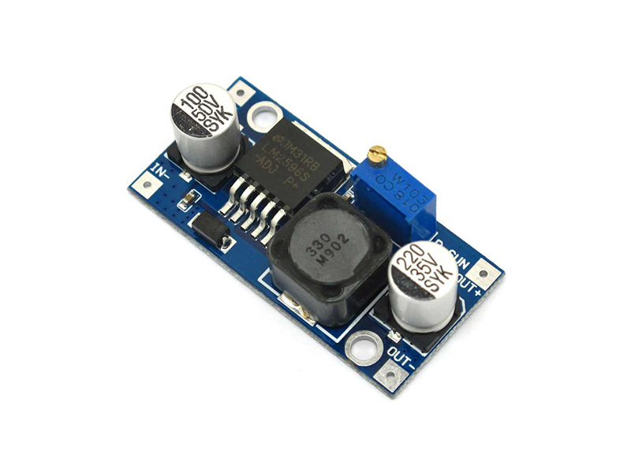
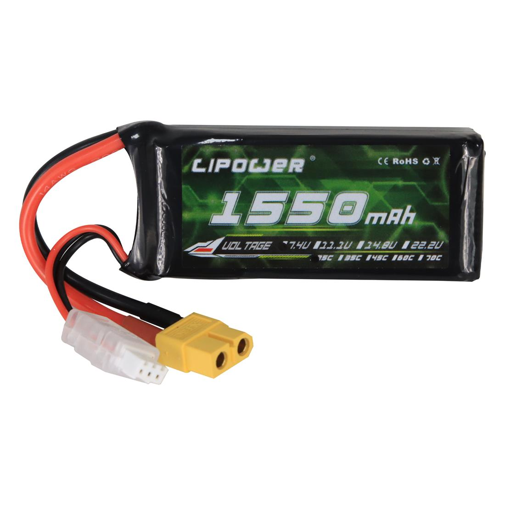
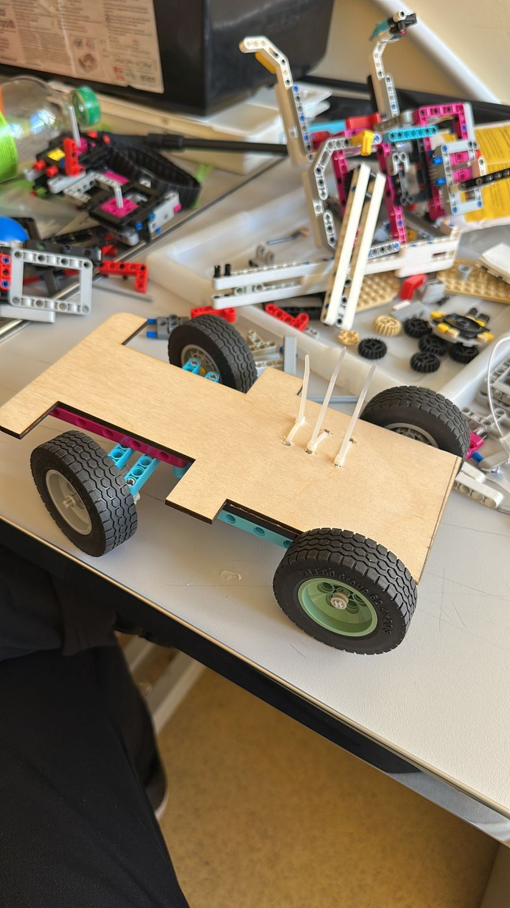

# wro-future-engineers
Проект робота для WRO Future Engineers: код, электроника, механика и документация
# Team NEXUS – WRO Future Engineers 2026

## Building a Stable and Reliable Autonomous Vehicle
Welcome to the official GitHub repository of **Team NEXUS** from **Shymkent, Kazakhstan**, participating in the **World Robot Olympiad (WRO) Future Engineers** category.

Team NEXUS is developing an autonomous vehicle built around practical engineering principles. Our main goal is to create a robot that is **stable, reliable, and mechanically strong**, while also being capable of real-time perception and autonomous decision making on the competition field.

Our robot combines **Raspberry Pi 4**, **Arduino Uno**, **computer vision**, **sensor-based support**, and a **wooden chassis** to form a complete autonomous system. This repository documents our engineering process, including hardware, software, testing, and future improvements as we prepare for our first regional stage.

_Last updated: [DATE]_

---

## Team Information

| Category | Details |
|---|---|
| **Team Name** | NEXUS |
| **Country** | Kazakhstan |
| **City** | Shymkent |
| **Competition Category** | WRO Future Engineers 2026 |
| **Team Members** | Sadykbek Nurassyl, Yeshankul Zhansultan |
| **Mentor** | Orynbasarov Bakdaulet |

---

## Team Roles

| Team Member | Main Responsibilities |
|---|---|
| **Sadykbek Nurassyl** | Responsible for **documentation**, **GitHub organization**, and support in the overall robot development process. His work includes maintaining the technical structure of the project, organizing development materials, and supporting the team in presenting and documenting the engineering progress clearly and professionally. |
| **Yeshankul Zhansultan** | Responsible for **building the robot** and **coding**. His work focuses on the practical construction of the robot, integration of components, and development of the software needed for autonomous operation and control. |

These roles help our team maintain a balanced workflow between **engineering development**, **technical implementation**, and **project documentation**, allowing us to improve the robot in a more organized and effective way.

---

## Team Vision
Our main engineering objective is to build a robot that is:

- **stable in movement**
- **reliable in mechanical structure**
- **practical under real competition conditions**
- **easy to test, debug, and improve**

We believe that strong engineering is based not only on speed, but on **consistency, control, mechanical reliability, and continuous improvement**.

---

## Project Goal
The main goal of Team NEXUS is to develop a **stable and reliable autonomous robot** for the WRO Future Engineers challenge.

Our engineering priorities are:
- reliable mechanical construction
- stable camera-based perception
- robust autonomous decision making
- practical and easy-to-improve system architecture
- strong integration between hardware and software

---

## Our Robot

<p align="center">
  
  
</p>

<p align="center">
  <b>Current robot photos / final assembled robot</b>
</p>

---

## Project Overview
This repository contains the documentation and source code for our WRO Future Engineers robot.

Our project combines:
- **computer vision** for field understanding
- **Arduino-based motion control**
- **color recognition**
- **wall and line detection**
- **gyroscope-supported orientation**
- **a wooden chassis designed for strength and simplicity**

At the current stage of development, our focus is on:
- stable camera calibration
- reliable color detection
- robust wall recognition
- line detection and counting
- consistent turning behavior
- integration between Raspberry Pi and Arduino
- mechanical stability

---

## Current Development Status
Our robot is currently under active development and testing.

At this stage:
- the mechanical structure is assembled
- the electronics are integrated
- the camera system is being calibrated
- the software is still under development
- final competition times will be added later

This is our **first regional stage**, and we continue improving both hardware and software through testing.

---

## Main Features
Our robot is being developed to support the following functions:

- autonomous driving on the WRO field
- red and green block detection
- blue and orange line detection
- wall recognition
- real-time decision making
- gyroscope-assisted orientation support
- modular software structure for future improvements

---

## Robot Dimensions

| Parameter | Value |
|---|---|
| **Length** | 22 cm |
| **Width** | 12 cm |
| **Weight** | 1.3 kg |

The size of the robot plays an important role in its mechanical stability, turning behavior, component placement, and overall field performance. Our current design is based on a practical balance between structural strength, reliability, and effective integration of the main subsystems.

---

## Materials and Components

<table>
  <tr>
    <th>Photo</th>
    <th>Component</th>
    <th>Function in the Robot</th>
  </tr>
  <tr>
    <td></td>
    <td><b>Raspberry Pi 4</b></td>
    <td>Main onboard computer responsible for computer vision, image processing, and high-level decision making.</td>
  </tr>
  <tr>
    <td></td>
    <td><b>Raspberry Pi Camera</b></td>
    <td>Captures the field view and provides image data for detecting colored blocks, lines, and walls.</td>
  </tr>
  <tr>
    <td></td>
    <td><b>Arduino Uno</b></td>
    <td>Handles low-level control tasks and executes movement-related commands.</td>
  </tr>
  <tr>
    <td></td>
    <td><b>DC Motor with Encoder</b></td>
    <td>Drives the robot forward and provides motion feedback for more accurate control.</td>
  </tr>
  <tr>
    <td></td>
    <td><b>Servo Motor</b></td>
    <td>Controls the steering angle of the robot.</td>
  </tr>
  <tr>
    <td></td>
    <td><b>Motor Driver</b></td>
    <td>Supplies and regulates power for the drive motor according to control commands.</td>
  </tr>
  <tr>
    <td></td>
    <td><b>Gyroscope</b></td>
    <td>Provides orientation-related data to improve turning consistency and heading stability.</td>
  </tr>
  <tr>
    <td></td>
    <td><b>Power Converter / Voltage Regulator</b></td>
    <td>Ensures stable voltage delivery to different electronic subsystems.</td>
  </tr>
  <tr>
    <td></td>
    <td><b>Battery / Power Source</b></td>
    <td>Supplies electrical power to the robot during operation.</td>
  </tr>
  <tr>
    <td></td>
    <td><b>Wooden Chassis</b></td>
    <td>Serves as the main structural frame of the robot and supports all mounted components.</td>
  </tr>
</table>

---

## Mechanical Design

| Mechanical Element | Description |
|---|---|
| **Chassis Material** | Wood |
| **Design Goal** | Strong, stable, and reliable construction |
| **Main Priority** | Mechanical stability and reliability |
| **Structure Type** | Simple and practical layout for easier maintenance and upgrades |
| **Development Focus** | Stable component mounting, balanced structure, reliable steering mechanics, and smooth power transmission |

Our robot uses a **wooden chassis** because it allows practical construction, fast modification, and stable mounting of major subsystems. The design is focused on reliability and straightforward engineering rather than unnecessary complexity.

The mechanical layout also includes a **steering mechanism** and a **differential mechanism**, which are important parts of the overall drive system. These mechanisms help the robot maintain controlled motion, directional accuracy, and more stable behavior on the field.

---

## Drive and Steering Mechanism

<table>
  <tr>
    <th>Photo</th>
    <th>Mechanism</th>
    <th>Function</th>
  </tr>
  <tr>
    <td></td>
    <td><b>Steering Mechanism</b></td>
    <td>This mechanism is responsible for directional control. It connects the servo motor to the steering system and changes the angle of the front wheels, allowing the robot to change direction accurately during navigation and obstacle avoidance.</td>
  </tr>
  <tr>
    <td></td>
    <td><b>Differential Mechanism</b></td>
    <td>This mechanism is part of the drive transmission system. It helps transfer motion within the drivetrain and supports smoother wheel movement, improving stability and overall mechanical performance.</td>
  </tr>
</table>

### Drive System
The main propulsion is provided by a **DC motor with encoder**. The motor is connected to the drive system and transfers rotational motion to the wheels, allowing the robot to move forward on the field. The encoder provides motion feedback that can support more consistent movement and improve control accuracy.

### Steering System
The robot uses a **servo-based steering system**. The servo motor controls the steering mechanism, which turns the front wheels according to the decisions made by the vision and control logic.

### Mechanical Design Priorities
The drive and steering systems were developed with a focus on:
- stability
- reliability
- practical construction
- easy maintenance
- compatibility with the wooden chassis

---

## Potential Improvements and Future Development

As our project continues to evolve, we see several important areas for future improvement in both the mechanical and software parts of the robot.

### Mechanical Improvements
- reducing overall robot weight
- improving compactness of the chassis
- optimizing component placement for better balance
- improving structural efficiency while keeping mechanical reliability

One of the practical future improvements is the **reduction of weight and overall size by replacing the current larger power bank with a smaller and more compact power solution**. This could help decrease total mass, free up internal space, and improve the overall proportions of the robot.

### Design and CAD Development
We are also interested in improving our engineering workflow through **3D CAD design**. Since we are still learning this area, future work may include:
- creating more accurate 3D models of the robot
- designing components and mounts digitally before building them
- improving precision in mechanical planning
- using CAD as a tool for better structural optimization

This is an important direction for our team because learning CAD will help us better understand engineering design and improve future versions of the robot.

### Software and Control Improvements
Future software improvements may include:
- more stable camera calibration
- better wall detection
- improved line counting logic
- better turning precision
- stronger integration between Raspberry Pi and Arduino
- more reliable behavior under different lighting conditions

### Additional Improvement Direction
Another valuable improvement would be the development of a more systematic **testing and calibration process**, including repeated mechanical checks, sensor validation, and structured tuning of vision parameters. This would help the robot become more predictable and reliable in real competition conditions.

---

## Electronic System

| Subsystem | Role |
|---|---|
| **Vision System** | Raspberry Pi 4 + Raspberry Pi Camera |
| **Control System** | Arduino Uno |
| **Drive System** | DC motor with encoder + motor driver |
| **Steering System** | Servo motor + steering mechanism |
| **Orientation Support** | Gyroscope |
| **Power Distribution** | Battery and voltage converters |

The robot electronics are divided into two logical layers:

1. **High-level processing on Raspberry Pi**
   - camera input
   - image processing
   - color detection
   - wall detection
   - decision making

2. **Low-level execution on Arduino**
   - steering control
   - motor control
   - receiving motion commands

This architecture makes the system more modular and easier to debug.

---

## Software Architecture
The software is designed with a modular structure so that each subsystem can be tested and improved independently.

### Main software tasks
- camera initialization
- frame capture
- HSV-based color detection
- red and green block recognition
- blue and orange line detection
- wall detection
- movement decision logic
- communication between Raspberry Pi and Arduino
- future lap / line counting logic
- challenge completion logic

### Planned movement logic
- detect important field objects through the camera
- classify relevant objects in real time
- determine whether the robot should go forward, turn left, turn right, or stop
- combine camera-based logic with gyroscope support for stability

---

## Repository Structure

```text
/docs/                  -> main technical documentation
/images/                -> robot photos, material photos, diagrams
/src/raspberry_pi/      -> Raspberry Pi vision and decision-making code
/src/arduino/           -> Arduino control code
/config/                -> camera, HSV, and robot parameters
/tests/                 -> testing notes and debugging results
/media/                 -> videos or video links
